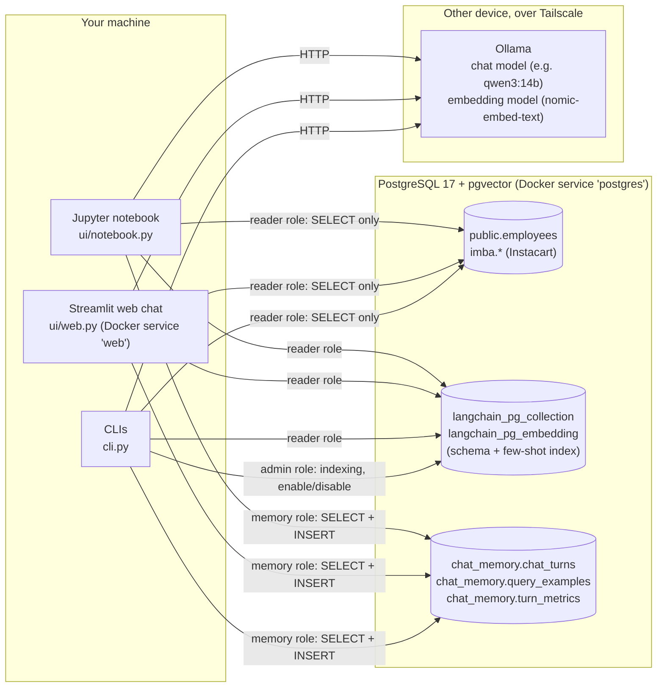
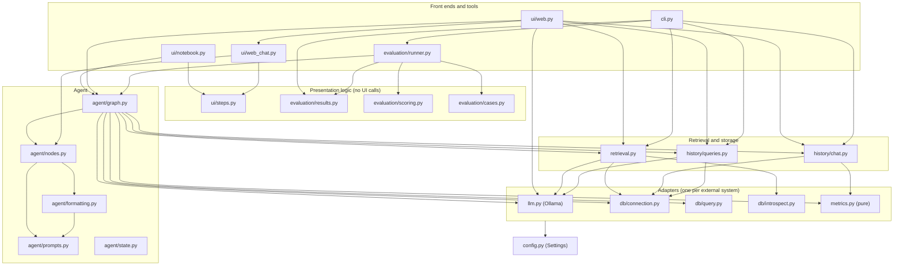
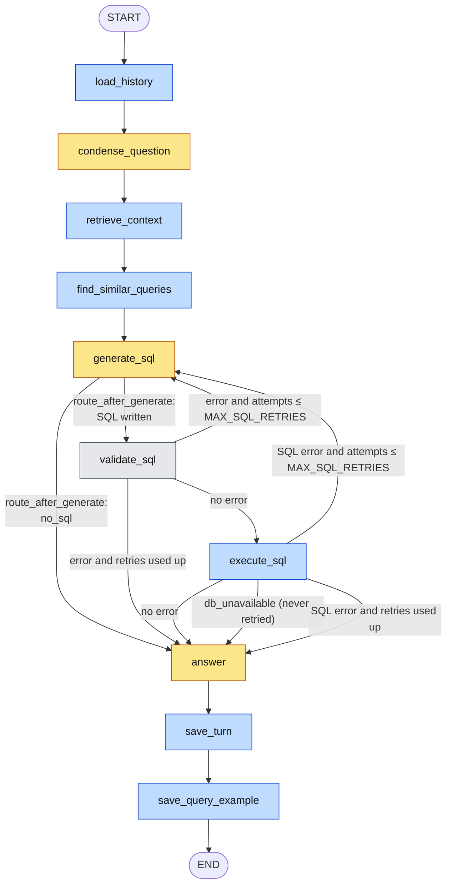
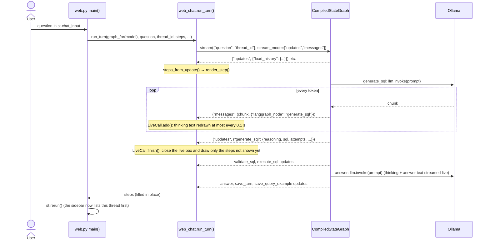
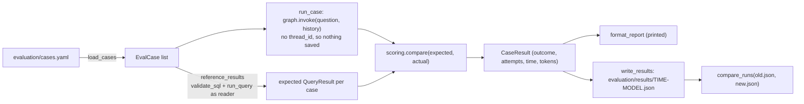
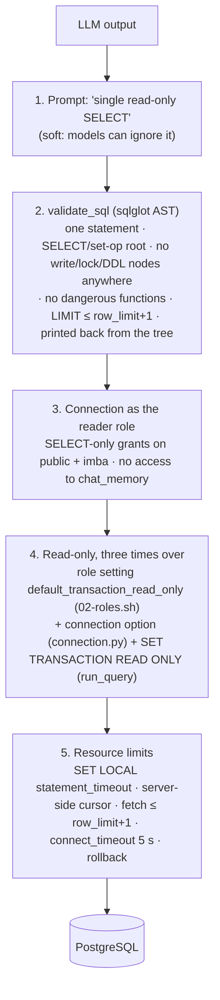
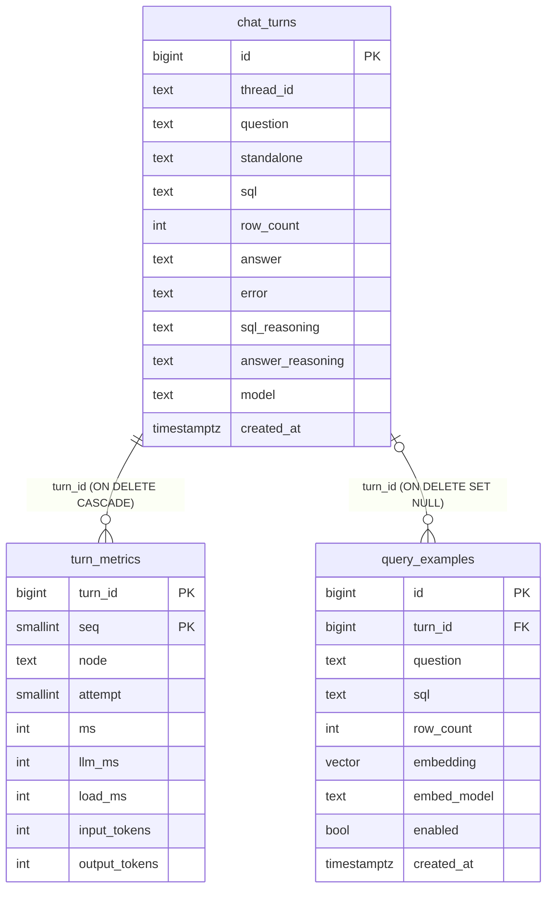

# EXPLAIN: how RAG-SQL-Layer works, down to the code

This document explains the whole `src/rag_sql` package: what each module is for, how the pieces
fit together, and what every important function does line by line. It is written to be read next
to the code: references look like `agent/graph.py:31` (path relative to `src/rag_sql/` unless it
starts with a repo folder such as `db/init/` or `tests/`).

`CLAUDE.md` is the short rulebook ("what must hold"). This file is the long explanation ("how and
why it holds").

---

## Contents

0. [How to read this document](#0-how-to-read-this-document)
1. [The big picture](#1-the-big-picture)
2. [The life of one question](#2-the-life-of-one-question)
3. [The agent graph](#3-the-agent-graph)
4. [Module by module](#4-module-by-module)
   - 4.1 [config.py](#41-configpy)
   - 4.2 [llm.py](#42-llmpy)
   - 4.3 [db/connection.py](#43-dbconnectionpy)
   - 4.4 [db/introspect.py](#44-dbintrospectpy)
   - 4.5 [db/query.py](#45-dbquerypy)
   - 4.6 [retrieval.py](#46-retrievalpy)
   - 4.7 [history/chat.py](#47-historychatpy)
   - 4.8 [history/queries.py](#48-historyqueriespy)
   - 4.9 [metrics.py](#49-metricspy)
   - 4.10 [agent/state.py](#410-agentstatepy)
   - 4.11 [agent/prompts.py](#411-agentpromptspy)
   - 4.12 [agent/formatting.py](#412-agentformattingpy)
   - 4.13 [agent/nodes.py](#413-agentnodespy)
   - 4.14 [agent/graph.py](#414-agentgraphpy)
   - 4.15 [ui/steps.py](#415-uistepspy)
   - 4.16 [ui/notebook.py](#416-uinotebookpy)
   - 4.17 [ui/web.py](#417-uiwebpy)
   - 4.18 [ui/web_chat.py](#418-uiweb_chatpy)
   - 4.19 [cli.py](#419-clipy)
   - 4.20 [evaluation/](#420-evaluation)
5. [Cross-cutting topics](#5-cross-cutting-topics)
6. [Supporting files outside src/](#6-supporting-files-outside-src)
7. [Cheat sheets](#7-cheat-sheets)

---

## 0. How to read this document

- **Quick tour (15 min):** sections 1, 2 and 3. After that you know what happens to a question
  and why.
- **Deep dive:** section 4 goes through the modules in *dependency order*: every module only
  uses modules explained before it. `config.py` comes first and the front ends come last.
- **Looking something up:** section 7 has a glossary and a "to change X, touch Y" table.

Diagrams are written in Mermaid. GitHub, GitLab and VS Code (with a Mermaid extension) draw them
as pictures. The main agent graph also has an ASCII version for plain terminals.

---

## 1. The big picture

### 1.1 What the project does

A user asks a question in plain language ("Which department has the highest average salary?").
The agent:

1. finds the parts of the database schema that matter for the question (**R**etrieval),
2. uses them to prompt a local LLM to write one PostgreSQL `SELECT` (**A**ugmented **G**eneration),
3. checks the SQL is read-only, runs it as a read-only user and gets rows back,
4. asks the LLM to answer the question from those rows.

Every step is streamed to the user: the model's thinking, the SQL, the result table and the
answer. It also remembers conversations (so "and the lowest?" works) and past successful queries
(to use them as examples for similar questions later).

### 1.2 The systems involved



There are **three database roles**, and which one a piece of code uses is the backbone of the
security model (see [5.1](#51-security-in-layers)):

| Role | Setting keys | Can do | Used by |
|---|---|---|---|
| `reader` | `APP_DB_USER` / `APP_DB_PASSWORD` | `SELECT` on `public` and `imba`, every transaction read-only | the agent's SQL, the retriever |
| `memory` | `CHAT_DB_USER` / `CHAT_DB_PASSWORD` | `SELECT` + `INSERT` on the three `chat_memory` tables only | chat history, query history, metrics |
| `admin` | `POSTGRES_USER` / `POSTGRES_PASSWORD` | everything | `rag-sql-index`, `rag-sql-history disable/enable` |

### 1.3 Module map (who imports whom)



Reading the arrows from bottom to top gives the layers:

1. **`config.py`**: the only module that reads environment variables.
2. **Adapters**: one module per external thing. `llm.py` is the only place that knows about Ollama,
   and `db/*` is the only place that builds SQLAlchemy engines or runs agent SQL. `metrics.py` is
   pure data handling.
3. **Retrieval and storage**: the vector index (`retrieval.py`) and the `chat_memory` stores
   (`history/*`).
4. **The agent**: nodes, prompts, formatting, and the graph that wires them.
5. **Front ends**: notebook, web, CLI and evaluation. They *use* the agent but contain no agent
   logic.

### 1.4 Design rules that shape the code

These rules come from `CLAUDE.md` and explain a lot of "why is it written like this":

- **Factories are the seams.** `get_chat_model`, `get_embeddings`, `get_engine`, `get_retriever`,
  `get_chat_store`, `get_query_history` and `build_graph` create the real thing, but every one
  accepts overrides. Tests pass fakes instead, so nothing needs a network.
- **Nodes are pure functions** `(state) -> partial update`. Their dependencies (LLM, retriever,
  stores) are bound with `functools.partial` in `build_graph`, never created at import time.
- **No side effects at import.** Importing any module opens no connection. Engines, models and
  stores are built on first use and then cached.
- **One concern per module.** All prompts live in `prompts.py`. Everything that touches
  `chat_memory` is in `history/`. What a step *shows* is decided in `ui/steps.py`, and *how* it
  is drawn in the notebook/web modules.

---

## 2. The life of one question

This section follows a real run end to end. The trace below was produced by running the actual
`build_graph()` with the test fakes (`tests/conftest.py`: a fake LLM, a retriever that returns
one table doc and one example doc, in-memory stores). The model replies and the result rows are
made up, but **every node, every state key and every prompt text is exactly what the code
produces.**

### 2.1 Turn 1: "Which department has the highest average salary?"

Input: `{"question": "Which department has the highest average salary?", "thread_id": "t1"}`.

| # | Node | What it did | Update it returned |
|---|---|---|---|
| 1 | `load_history` | Thread `t1` has no turns yet | `history: []` |
| 2 | `condense_question` | No history, so **no model call**: the question already stands on its own | `standalone_question: "Which department has the highest average salary?"` |
| 3 | `retrieve_context` | Embedded the question once, searched pgvector for up to 6 table docs and 3 example docs | `context: [Document(table employees), Document(example "Who are the 5 highest paid…")]` |
| 4 | `find_similar_queries` | Searched `chat_memory.query_examples`: nothing stored yet | `similar_queries: []` |
| 5 | `generate_sql` | Model call #1 (prompt in 2.3) | `reasoning: "Group by department…"`, `sql: "SELECT department, round(avg(salary), 2) … LIMIT 1;"`, `no_sql: False`, `error: None`, `result: None`, `attempts: 1` |
| 6 | `validate_sql` | Parsed with sqlglot, checked it's read-only, kept `LIMIT 1` (≤ 201), printed it back from the parsed tree | `sql: "SELECT\n  department,\n  ROUND(CAST(AVG(salary) AS DECIMAL), 2) AS avg_salary\n…LIMIT 1"`, `error: None` |
| 7 | `execute_sql` | Ran it as the read-only role | `result: QueryResult(columns=['department','avg_salary'], rows=[('Engineering', 98765.43)], truncated=False)`, `error: None`, `db_unavailable: False` |
| 8 | `answer` | Model call #2 with the rows as a Markdown table | `answer: "Engineering has the highest average salary, about 98,765.43."`, `answer_reasoning: None` |
| 9 | `save_turn` | Built a `Turn` and inserted it (plus 8 metric rows) into `chat_memory` | `history: [turn]`, `turn_id: 1`, `turn_metrics: {...}` |
| 10 | `save_query_example` | The SQL ran and returned ≥ 1 row, so (standalone question, SQL) is embedded and stored | `example_saved: True` |

Every update above also carries `metrics: [NodeMetric]`. The `timed()` wrapper adds it (see
[3.5](#35-the-timed-wrapper-and-metrics)).

Note what `validate_sql` did to the SQL. The model wrote `round(avg(salary), 2)`, and the
validated version is `ROUND(CAST(AVG(salary) AS DECIMAL), 2)`. The query that runs is **printed
back from sqlglot's parsed tree**, not the model's text, so what runs is exactly what was checked.
sqlglot also adds a cast, because Postgres only has the two-argument `round()` for `numeric`
values.

### 2.2 Turn 2 (follow-up): "And the lowest?"

Same thread, input `{"question": "And the lowest?", "thread_id": "t1"}`.

The graph has **no checkpointer**, so every run starts from empty state (`attempts` restarts at
1). Memory comes only from `ChatStore`:

| # | Node | What changed compared with turn 1 |
|---|---|---|
| 1 | `load_history` | `history: [turn 1]` loaded from `chat_memory.chat_turns` |
| 2 | `condense_question` | **Model call.** Rewrites the follow-up: `standalone_question: "Which department has the lowest average salary?"` |
| 3 | `retrieve_context` | Searches with the *standalone* question, not "And the lowest?" |
| 4 | `find_similar_queries` | Finds turn 1's pair (similarity 0.75 with the test embeddings) → `similar_queries: [PastQuery(...)]`. Query history isn't per thread: any thread's successful queries can show up. |
| 5 | `generate_sql` | The prompt now also has the "Similar questions" and "Earlier questions … and their SQL" sections |
| 6–10 | … | Same as turn 1 |

### 2.3 The prompts the model actually saw on turn 2

**`condense_question`** (`agent/prompts.py:8`):

```text
[system]
You rewrite follow-up questions about a database so they can be understood without the conversation.

Rules:
- Use the conversation to resolve references such as "it", "they", "that department", "the same" or "and the lowest?".
- Keep every filter, grouping and number from the follow-up. Carry over conditions from earlier questions only when the follow-up clearly continues them.
- If the follow-up already stands on its own, return it unchanged.
- Reply with the rewritten question only: no explanation, no SQL, no quotes.
[human]
Conversation so far (oldest first):
Question: Which department has the highest average salary?
Answer: Engineering has the highest average salary, about 98,765.43.

Follow-up question: And the lowest?
```

**`generate_sql`** (`agent/prompts.py:29`). The system message is the rules list (see
[4.11](#411-agentpromptspy)). The human message is built from five optional sections:

````text
[human]
Database schema:
Table employees
  emp_name TEXT
  salary NUMERIC(12, 2)

Example questions with correct SQL:
Question: Who are the 5 highest paid employees?
```sql
SELECT emp_name FROM employees ORDER BY salary DESC LIMIT 5;
```

Similar questions answered earlier, with SQL that ran successfully (check it fits this question before reusing it):
Question: Which department has the highest average salary?
```sql
SELECT
  department,
  ROUND(CAST(AVG(salary) AS DECIMAL), 2) AS avg_salary
...
LIMIT 1
```

Earlier questions in this conversation and their SQL (oldest first):
Question: Which department has the highest average salary?
```sql
SELECT
  department,
  ...
LIMIT 1
```

Question: Which department has the lowest average salary?
````

(With the real retriever, "Database schema" holds the full `TableDoc.to_text()` of up to 6
tables, with column comments. See [4.4](#44-dbintrospectpy).)

**`answer`** (`agent/prompts.py:83`):

````text
[system]
You answer questions about a database. Use only the SQL result provided. Be concise and state the key numbers. If the result is empty, say that no matching data was found. If the result was truncated, mention that only part of it is shown. If the result doesn't answer the question, say that you couldn't answer it from the database instead of reporting the result. Do not repeat the SQL.
[human]
Earlier in this conversation (oldest first):
Question: Which department has the highest average salary?
Answer: Engineering has the highest average salary, about 98,765.43.

Question: Which department has the lowest average salary?

SQL:
```sql
SELECT
  department,
  ...
ORDER BY
  avg_salary ASC
LIMIT 1
```

Result (1 row(s)):
| department | avg_salary |
|---|---|
| HR | 61234.50 |
````

Note what each prompt gets from the history:

| Prompt | Earlier questions | Earlier SQL | Earlier answers | Model thinking |
|---|---|---|---|---|
| `CONDENSE_PROMPT` | yes | no | yes (first 500 chars) | never |
| `SQL_GENERATION_PROMPT` | yes | **yes** | no | never |
| `ANSWER_PROMPT` / `CHAT_REPLY_PROMPT` | yes | no | yes (first 500 chars) | never |

This comes from `format_history(history, sql=..., answers=...)` (`agent/formatting.py:97`).
Thinking is saved to the database but **never** put back into a prompt.

---

## 3. The agent graph

### 3.1 The flowchart



Colors: **yellow** nodes may call the chat model. **Blue** nodes touch Postgres (and, for
retrieval and query history, the embedding model). **Grey** is pure Python.

The same graph in ASCII:

```text
START
  │
  ▼
load_history ──► condense_question ──► retrieve_context ──► find_similar_queries
                                                                   │
                     ┌─────────────────────────────────────────────┘
                     ▼
              ┌─► generate_sql ───────── no_sql ───────────────────────────┐
              │      │ SQL                                                  │
              │      ▼                                                      │
              ├── validate_sql ── error & retries left                      │
              │      │ ok        error & no retries left ─────────────────►┤
              │      ▼                                                      │
              └── execute_sql ─── SQL error & retries left                  │
                     │ ok / db_unavailable / no retries left ──────────────►┤
                                                                            ▼
                                                                         answer
                                                                            │
                                                                            ▼
                                                                        save_turn
                                                                            │
                                                                            ▼
                                                                  save_query_example
                                                                            │
                                                                            ▼
                                                                           END
```

The wiring is in `agent/graph.py:122-145`. The first four edges are plain `add_edge`s, the three
branch points are `add_conditional_edges` with a `route_*` function, and the tail is plain again.

### 3.2 The three routing functions

All routing lives in `agent/graph.py`, never inside nodes. Each function looks at the state
*after* the node ran and returns the name of the next node.

```python
def _should_retry(state, max_retries):          # graph.py:26
    return state.get("attempts", 0) <= max_retries

def route_after_generate(state):                 # graph.py:31
    return "answer" if state.get("no_sql") else "validate_sql"

def route_after_validate(state, max_retries):    # graph.py:36
    if not state.get("error"):
        return "execute_sql"
    return "generate_sql" if _should_retry(state, max_retries) else "answer"

def route_after_execute(state, max_retries):     # graph.py:44
    if not state.get("error") or state.get("db_unavailable"):
        return "answer"
    return "generate_sql" if _should_retry(state, max_retries) else "answer"
```

Truth table:

| After | `no_sql` | `error` | `db_unavailable` | `attempts ≤ max` | → next |
|---|---|---|---|---|---|
| `generate_sql` | True | – | – | – | `answer` |
| `generate_sql` | False | – | – | – | `validate_sql` |
| `validate_sql` | – | None | – | – | `execute_sql` |
| `validate_sql` | – | set | – | yes | `generate_sql` |
| `validate_sql` | – | set | – | no | `answer` |
| `execute_sql` | – | None | – | – | `answer` |
| `execute_sql` | – | set | True | – | `answer` (no retry: new SQL can't fix a down database) |
| `execute_sql` | – | set | False | yes | `generate_sql` |
| `execute_sql` | – | set | False | no | `answer` |

`route_after_validate` and `route_after_execute` take `max_retries` as a second argument, which
LangGraph can't provide, so `build_graph` binds it with `partial(route_after_validate,
max_retries=s.max_sql_retries)` (`graph.py:134`). The third argument of `add_conditional_edges`
(the list of possible targets) lets LangGraph draw and validate the graph without calling the
function.

### 3.3 How retries are counted

`attempts` counts **SQL generations**, not retries. `generate_sql` sets
`attempts = previous + 1` (`nodes.py:141`), and `_should_retry` allows another generation while
`attempts <= MAX_SQL_RETRIES`. So the model gets **`MAX_SQL_RETRIES + 1` tries in total**. With
the default `MAX_SQL_RETRIES=3`:

| Generation | `attempts` after `generate_sql` | SQL fails → `attempts ≤ 3`? | Next |
|---|---|---|---|
| 1st (the original) | 1 | yes | `generate_sql` (retry 1 of 3) |
| 2nd | 2 | yes | `generate_sql` (retry 2 of 3) |
| 3rd | 3 | yes | `generate_sql` (retry 3 of 3) |
| 4th | 4 | **no** | `answer` → "I couldn't produce a working SQL query after 4 attempt(s). Last error: …" |

`tests/test_graph.py::test_gives_up_after_max_retries` checks exactly this, with
`max_sql_retries=2` → `generate_sql` runs 3 times.

On a retry, `generate_sql` sees `state["error"]` and `state["sql"]` from the failed attempt and
adds the `SQL_RETRY_FEEDBACK` section to the prompt ("Your previous query failed. Previous query:
… Error: … Fix the problem …"). It then clears `error` and `result`, so the next router decides
only on the new attempt.

The error shown to the model is:

- a **validation error**: the `SQLValidationError` message, e.g. `Only SELECT queries are allowed,
  got DROP statement.`
- an **execution error**: the *first line* of the Postgres driver message, e.g.
  `column "salry" does not exist` (`nodes.py:159`).

### 3.4 Which node reads and writes which state field

`AgentState` (`agent/state.py:14`) is a `TypedDict(total=False)`: every key is optional, and a
node returns only the keys it changes. LangGraph merges each update into the state, and for most
keys the new value replaces the old one. The exception is `metrics`, whose reducer
(`operator.add`) *appends* to it.

| Field | Written by | Read by |
|---|---|---|
| `thread_id` | caller (input) | `load_history`, `save_turn`, `save_query_example` |
| `question` | caller (input) | almost every node |
| `history` | caller (input, stateless mode), `load_history`, `save_turn` (appends this turn) | `condense_question`, `generate_sql`, `answer` |
| `standalone_question` | `condense_question` | everything after, through `current_question()` |
| `context` | `retrieve_context` | `find_similar_queries` (to drop duplicates), `generate_sql`, `answer` (`chat_reply`: table names) |
| `similar_queries` | `find_similar_queries` | `generate_sql` |
| `reasoning` | `generate_sql` | `save_turn` (as `sql_reasoning`) |
| `sql` | `generate_sql` (raw), `validate_sql` (normalized, only when valid) | `generate_sql` (retry feedback), `execute_sql`, `answer`, `save_turn`, `save_query_example` |
| `no_sql` | `generate_sql` | `route_after_generate`, `answer` |
| `error` | `generate_sql` (clears), `validate_sql`, `execute_sql` | routers, `generate_sql` (feedback), `answer`, `save_turn` |
| `db_unavailable` | `execute_sql` | `route_after_execute`, `answer` |
| `attempts` | `generate_sql` | routers, `answer` (failure message), `timed()` (metric's `attempt`) |
| `result` | `generate_sql` (clears), `execute_sql` | `answer`, `save_turn`, `save_query_example` |
| `answer`, `answer_reasoning` | `answer` | `save_turn` |
| `turn_id` | `save_turn` | `save_query_example` (links the example to the turn) |
| `turn_metrics` | `save_turn` | front ends (the timing expander) |
| `example_saved` | `save_query_example` | front ends ("Saved to query history") |
| `metrics` | **every node**, through `timed()` | `save_turn` (summarized) |

### 3.5 The `timed()` wrapper and metrics

Every node is registered as `timed(name, step)` (`graph.py:124`), not as the bare function:

```python
def timed(name, node):                                     # graph.py:51
    def run(state):
        start = time.perf_counter()
        update = dict(node(state))                         # run the real node
        ms = round((time.perf_counter() - start) * 1000)   # wall time, model + DB included
        usage = update.pop("llm_usage", None)              # not a state key: take it out
        attempt = update.get("attempts", state.get("attempts", 0))
        update["metrics"] = [node_metric(name, attempt=attempt, ms=ms, usage=usage)]
        return update
    return run
```

- Nodes that call the model return an extra `llm_usage` key (`metrics.usage_of(message)`: Ollama's
  model time, load time and token counts). `llm_usage` isn't declared in `AgentState`, so it has to
  be removed before LangGraph sees the update. `timed()` moves it into the metric.
- `attempt` is the attempt the node ran in. `generate_sql` returns the new `attempts`, so its own
  metric gets the new number, and nodes before the first generation get 0.
- The update gets `metrics: [one NodeMetric]`. Because the state declares
  `metrics: Annotated[list[NodeMetric], operator.add]` (`state.py:34`), LangGraph *concatenates*
  instead of replacing. After a run with one retry, `state["metrics"]` holds entries for
  `generate_sql` (attempt 1), `validate_sql` (1), `generate_sql` (2), `validate_sql` (2), ….
- `save_turn` summarizes `state["metrics"]` into `TurnMetrics` while it runs. Its own metric is
  added by `timed()` *after* it returns, so the saved turn's time "ends with the answer". The two
  save nodes aren't counted.

### 3.6 How `build_graph()` wires dependencies

```python
# Abridged from graph.py:79-121
def build_graph(*, llm=None, retriever=None, query_runner=None,
                chat_store=None, query_history=None, settings=None):
    s = settings or get_settings()
    llm = llm or get_chat_model(s)                   # ChatOllama
    retriever = retriever or get_retriever(s)        # pgvector, reader role
    if chat_store is None:
        chat_store = get_chat_store(s)               # Postgres, memory role
    if query_history is None:
        query_history = get_query_history(s)         # Postgres, memory role
    if query_runner is None:
        query_runner = default_query_runner(s)       # partial(run_query, reader engine, ...)
    steps = {
        "load_history": partial(nodes.load_history, store=chat_store, max_turns=s.chat_history_turns),
        "condense_question": partial(nodes.condense_question, llm=llm),
        ...
        "save_turn": partial(nodes.save_turn, store=chat_store, model=chat_model_name(llm)),
    }
```

- Every dependency can be passed in. When it isn't, the factory builds the real one. That is the
  whole "swap without touching the rest" story: tests pass `fake_llm(...)`,
  `RunnableLambda(lambda q: [TABLE_DOC])`, `InMemoryChatStore()`, and a lambda as `query_runner`.
- `chat_store` and `query_history` are checked with an explicit `is None` rather than `or`
  (`graph.py:96-99`), so any store that was passed in is kept, whatever its truth value.
- Settings values the nodes need (`max_turns`, `k`, `row_limit`, …) are bound here too, so nodes
  never call `get_settings()` themselves.
- `model=chat_model_name(llm)` stores which model answered with each turn. The web UI builds one
  graph per model, so this name is always right.
- `graph.compile()` returns a `CompiledStateGraph`, which has `.invoke(input)` (returns the final
  state) and `.stream(input, stream_mode=...)` (yields as it goes).

### 3.7 Streaming: how the front ends watch the graph

The graph itself doesn't know about UIs. Front ends call `graph.stream(...)`:

- **Notebook** (`ui/notebook.py:110`): `stream_mode="updates"` yields `{node_name: update}` after
  each node finishes. Each update becomes `Step`s (`ui/steps.py`) and is drawn.
- **Web** (`ui/web_chat.py:170`): `stream_mode=["updates", "messages"]` yields `(mode, payload)`
  tuples. `"messages"` payloads are `(message_chunk, metadata)` for **every token** of every model
  call made inside a node. LangGraph attaches a streaming callback, so `llm.invoke()` inside a
  node streams on its own, and `metadata["langgraph_node"]` says which node it came from.



Section [4.18](#418-uiweb_chatpy) explains `LiveCall` and what happens when a run is stopped.

### 3.8 The four ways a turn can end

| Ending | Path | Model calls | `answer` text comes from | Saved as a query example? |
|---|---|---|---|---|
| **Success** | … → execute ok → answer | condense (follow-ups only), 1+ generate, answer | `ANSWER_PROMPT` | yes, if ≥ 1 row |
| **Not a data question** (`NO_SQL`) | generate → answer | condense?, generate, chat reply | `CHAT_REPLY_PROMPT` (`chat_reply()`) | no (no SQL) |
| **Retries used up** | … → answer | condense?, N+1 generate | fixed text: "I couldn't produce a working SQL query after N attempt(s)…" | no |
| **Database unavailable** | execute → answer | condense?, generate | fixed text: "I couldn't run the query because the database is unavailable…" | no |

In all four cases the turn is still saved by `save_turn` (when there's a `thread_id`). A failed
turn in the history tells the next follow-up that the question went unanswered: `format_history`
writes `(no working SQL; error: …)` into the SQL prompt.

---

## 4. Module by module

Each module gets: **purpose**, **public API**, a **walk through the code**, **design notes and
pitfalls**, and the **tests** that cover it.

### 4.1 `config.py`

**Purpose.** The single place that reads environment variables and `.env`. Every other module
asks for a `Settings` object.

**Public API.** `Settings`, `get_settings()`, `PROJECT_ROOT`.

**Walk through.**

- `PROJECT_ROOT = Path(__file__).resolve().parents[2]` (`:11`). `__file__` is
  `<repo>/src/rag_sql/config.py`: `parents[0]` is `rag_sql/`, `[1]` is `src/`, `[2]` is the repo
  root. So `.env`, `examples/few_shot.yaml` and `evaluation/` are found whatever the current
  directory is (the notebook runs from `notebooks/`). In Docker the project is installed
  editable, so this resolves to `/app`.
- `Settings(BaseSettings)` (`:14`). `pydantic-settings` fills each field from, in order of
  priority: constructor arguments → environment variables (case-insensitive: `POSTGRES_HOST` →
  `postgres_host`) → the `.env` file → the default in the class.
  - `extra="ignore"`: `.env` may hold keys that aren't fields (e.g. `WEB_PORT`, which only
    `docker-compose.yml` uses).
  - Passwords are `SecretStr`. They print as `**********` in logs and reprs, and only
    `db/connection.py` calls `.get_secret_value()`.
  - Numeric fields use `Field(default, gt=/ge=/le=)`. A bad value (`SQL_ROW_LIMIT=0`) fails when
    `Settings()` is built, at startup, not deep inside a query. The comment on `sql_timeout_ms`
    explains `gt=0`: in Postgres, `statement_timeout = 0` means *no* timeout.
- `db_schemas: Annotated[tuple[str, ...], NoDecode]` (`:51`). By default pydantic-settings parses
  a complex-typed env var as JSON (`["public","imba"]`). `NoDecode` turns that off, so the
  validator gets the raw string `public,imba`.
- `_split_schemas` (`:60-69`, `mode="before"`, so it runs before type conversion):
  1. splits on commas and strips blanks,
  2. rejects an empty list,
  3. **rejects `chat_memory`**. That schema holds past conversations, and indexing it would put
     chat history into prompts and let generated SQL target it. This is one of several guards
     (the reader role has no grant on it either).
- `get_settings()` is `@lru_cache`d (`:72`): the first call builds `Settings()` and every later
  call returns the same object. Tests avoid it and build `Settings(_env_file=None, ...)` so a
  developer's `.env` never leaks into a test (`tests/conftest.py:37`).

**Pitfall.** Because of the cache, editing `.env` has no effect on a running process (Jupyter
kernel, Streamlit server) until it restarts.

**Tests.** `tests/test_config.py`.

---

### 4.2 `llm.py`

**Purpose.** The only module that knows the model provider is Ollama. Swapping to another
provider means changing this file only.

**Public API.** `get_chat_model()`, `get_embeddings()`, `chat_model_name()`,
`list_chat_models()`, `ChatModelInfo`, `CachedEmbeddings`.

**Walk through.**

- **`get_chat_model(settings, **overrides)`** (`:30`) builds a `ChatOllama` with `model`,
  `base_url`, `reasoning=OLLAMA_REASONING` and `temperature=0` (deterministic SQL). `overrides`
  win, which is how the web UI and eval pick another model: `get_chat_model(s, model="qwen3.5:9b",
  reasoning=False)`.
  - With `reasoning=True`, Ollama returns the model's thinking separately, and `langchain_ollama`
    puts it in `message.additional_kwargs["reasoning_content"]`. The main text stays in
    `message.content`. `agent/formatting.py:split_reasoning` reads both.
- **`CachedEmbeddings`** (`:47`) wraps any `Embeddings` with a small thread-safe LRU cache for
  `embed_query`:
  - In one turn the *same* standalone question is embedded three times: by the retriever, by
    `QueryHistory.search`, and by `QueryHistory.add`. With a shared instance that's one HTTP call
    to Ollama instead of three.
  - `OrderedDict` + `move_to_end` on a hit + `popitem(last=False)` when over `EMBED_CACHE_SIZE`
    (256) = least-recently-used eviction.
  - A `threading.Lock` guards the dict because Streamlit runs each browser session in its own
    thread and they share this object. The lock is **released during the network call**
    (`:65`), so two sessions don't wait on each other's embedding. Two threads might both miss
    and both compute the same vector, which is harmless.
  - It returns `list(vector)` copies so a caller can't change the cached vector.
  - `embed_documents` (used when indexing) is not cached: those texts are embedded once.
- **`get_embeddings(settings, **overrides)`** (`:76`). Without overrides it returns
  `_shared_embeddings(model, base_url)`, which is `@lru_cache`d, so **every caller with the same
  model shares one `CachedEmbeddings` and one cache**. This matters: `get_retriever()` and
  `get_query_history()` call `get_embeddings()` separately, and only this sharing makes the cache
  work across them. With overrides a fresh, unshared instance is returned.
- **`chat_model_name(llm)`** (`:92`): `getattr(llm, "model", None)`. `ChatOllama.model` is the
  model name, and fakes have no `model`, so this returns `None`.
- **`list_chat_models()`** (`:97`) asks the Ollama server which models it has
  (`client.list()`) and then, **for each one**, `client.show(name).capabilities`:
  - keeps a model if its capabilities include `"completion"` and not `"embedding"` (names can't
    tell them apart: `qwen3-embedding` is an embedding model),
  - records `thinking = "thinking" in capabilities`. Models without it *reject*
    `reasoning=True`, so the web UI and eval pass `reasoning=False` for them.
  - `LIST_TIMEOUT_S = 10` bounds each HTTP call.
  - This makes N+1 HTTP calls, which is why the web UI caches the result for 60 s.

**Tests.** `tests/test_llm.py`.

---

### 4.3 `db/connection.py`

**Purpose.** One SQLAlchemy `Engine` (= one connection pool) per database role.

**Public API.** `get_engine(role="reader"|"admin"|"memory", settings=None)`, `Role`.

**Walk through.**

```python
def get_engine(role="reader", settings=None):               # :17
    user, password = {"reader": (...), "admin": (...), "memory": (...)}[role]
    url = URL.create("postgresql+psycopg", username=user, password=..., host=..., ...)
    return _create_engine(url, read_only=role == "reader")

@lru_cache
def _create_engine(url, *, read_only):                       # :47
    connect_args = {"connect_timeout": CONNECT_TIMEOUT_S}    # 5 s
    if read_only:
        connect_args["options"] = "-c default_transaction_read_only=on"
    return create_engine(url, pool_pre_ping=True, connect_args=connect_args)
```

- `postgresql+psycopg` means the psycopg **3** driver.
- `URL.create(...)` escapes special characters in the password properly (building the URL by hand
  as a string would break on `@` or `/`).
- `_create_engine` is `@lru_cache`d on `(url, read_only)`. `URL` is hashable, so the same role and
  connection settings **always return the same engine**. The chat store and the query history
  both call `get_engine("memory")` and share one pool, and the web UI doesn't open a new pool per
  model.
- `connect_timeout=5`: without it, connecting to a host that's down can hang for minutes. With it,
  the error comes quickly, and `execute_sql` can report "database unavailable".
- `options=-c default_transaction_read_only=on` is sent **at connection time** for the reader. It
  is a second copy of the role-level setting in `db/init/02-roles.sh` (defense in depth, see
  [5.1](#51-security-in-layers)).
- `pool_pre_ping=True`: before handing out a pooled connection, SQLAlchemy checks it's still
  alive (e.g. after Postgres restarted) and reconnects if not.

**Rule.** LLM-generated SQL only ever runs on the `"reader"` engine.

**Tests.** `tests/test_connection.py`.

---

### 4.4 `db/introspect.py`

**Purpose.** Read the live schema (tables, columns, types, keys, comments) and turn each table
into compact text for the model. Used **only when building the index**, with the admin engine.

**Public API.** `introspect_tables(engine, schemas)`, `TableDoc`, `ColumnDoc`, `ForeignKeyDoc`.

**Walk through.**

- `introspect_tables` (`:64`) uses `sqlalchemy.inspect(engine)` (the `Inspector`) to call
  `get_table_names`, `get_columns`, `get_pk_constraint`, `get_foreign_keys` and
  `get_table_comment` for each table of each schema in `DB_SCHEMAS`. Tables starting with
  `langchain_pg_` (the vector store's own tables, `:8`) are skipped.
- `TableDoc.qualified_name` (`:36`): `employees` for `public`, `imba.orders` otherwise. The prompt
  tells the model to write names *exactly as the schema shows them*, and this is why an
  unqualified `orders` never appears.
- `TableDoc.to_text()` (`:39`) builds the text that is **embedded** (for retrieval) and **put in
  the prompt** (as "Database schema"). For `employees` it looks roughly like this (column types as
  SQLAlchemy prints them):

  ```text
  Table employees
    -- One row per employee: department, pay, age, performance and work location.
    emp_id INTEGER PRIMARY KEY  -- Surrogate primary key.
    emp_name TEXT NOT NULL  -- Employee name, unique (e.g. Employee_1).
    department TEXT  -- One of Engineering, Finance, HR, Marketing, Sales. NULL when unknown.
    salary NUMERIC(12, 2)  -- Annual salary. NULL when unknown.
    ...
  ```

  - `PRIMARY KEY` is shown for PK columns, and `NOT NULL` for non-nullable columns that aren't
    part of the PK (the PK already implies it).
  - `FOREIGN KEY (aisle_id) REFERENCES imba.aisles (aisle_id)` lines tell the model how to join.
  - **Column comments are how you teach the model about values.** "One of Engineering, Finance,
    …" is why the model writes `WHERE department = 'HR'` correctly. Better comments in
    `db/init/*.sql` mean better SQL. The prompt rule "Match text values exactly as described in
    the column comments" points the model at them.
- The dataclasses are `frozen=True`: they are values, never changed after they're built.

**Why a separate module from `db/query.py`?** Introspection needs the admin engine, and the
agent's code path must never touch admin credentials. Keeping them apart makes that easy to see
from the imports.

---

### 4.5 `db/query.py`

**Purpose.** Validate the agent's SQL and run it safely. The module docstring sums it up:
"Read-only three ways: SQL parse check, read-only role and txn."

**Public API.** `validate_sql(sql, row_limit) -> str`, `run_query(engine, sql, *, row_limit,
timeout_ms) -> QueryResult`, `is_database_unavailable(error) -> bool`, `QueryResult`,
`SQLValidationError`, `DIALECT`.

#### `QueryResult` (`:58`)

```python
@dataclass
class QueryResult:
    columns: list[str]
    rows: list[tuple]            # at most row_limit rows
    truncated: bool = False      # True when the database had more rows than row_limit
    @property
    def row_count(self): return len(self.rows)
```

#### `validate_sql(sql, row_limit)` step by step (`:84`)

1. **Empty?** → `SQLValidationError("Empty SQL statement.")`.
2. **Parse** with `sqlglot.parse(sql, read="postgres")`. `parse` (not `parse_one`) returns *every*
   statement, which is needed for step 3. On a `ParseError`, sqlglot's own message contains ANSI
   color codes, so a plain message is built from `e.errors` (description, line, col). That text
   goes back to the model on retry.
3. **Exactly one statement.** `SELECT 1; SELECT 2` → "Expected exactly one statement, got 2."
   This stops piggy-backed statements (`SELECT 1; DROP TABLE …`).
4. **Root must be a query.** `isinstance(tree, (exp.Select, exp.SetOperation))`. A
   `WITH … SELECT` parses as a `Select` with a `with` argument, and `UNION`/`INTERSECT`/`EXCEPT`
   are `SetOperation`s.
5. **Walk the whole tree** (`tree.walk()` visits every node, including inside CTEs and
   subqueries):
   - any node of a `_FORBIDDEN_NODES` type (`:16`) → reject. This catches **data-modifying CTEs**
     (`WITH d AS (DELETE … RETURNING *) SELECT …`, where the root *is* a SELECT), `SELECT … INTO
     new_table` (`exp.Into`), and `FOR UPDATE`/`FOR SHARE` (`exp.Lock`).
   - any function whose lower-cased name starts with a `_FORBIDDEN_FUNCTION_PREFIXES` entry
     (`:32`) → reject: sleeping, reading server files, killing backends, advisory locks,
     `set_config`, large objects (`lo_`), `dblink`, and **functions that run a SQL string**
     (`query_to_xml…`, `cursor_to_xml`). The walk can't see inside such a string, so the
     function is blocked outright. `_function_name` handles functions sqlglot doesn't know
     (`exp.Anonymous`, name in `.name`) as well as known ones (`sql_name()`).
6. **Cap the row count.** `cap = row_limit + 1`. `_row_count_limit(tree)` (`:73`) reads the
   outer `LIMIT n` / `FETCH FIRST n ROWS` as an int, or `None` when it's absent or not a plain
   integer (`LIMIT $1`, `LIMIT 10+5`). If it's `None` or `> cap`, `tree.limit(cap)` replaces it.
   Only the *outer* query is capped: a `LIMIT` inside a subquery is part of the logic.
7. **Print the tree back** with `tree.sql(dialect="postgres", pretty=True)`. **What runs is
   exactly what was checked**: comments, odd whitespace or anything sqlglot tolerated but didn't
   model can't slip through as text.

Real outputs (captured from this code, `row_limit=200`):

| Input | Result |
|---|---|
| `SELECT emp_name FROM employees` | `SELECT\n  emp_name\nFROM employees\nLIMIT 201` |
| `SELECT emp_name FROM employees LIMIT 5000` | … `LIMIT 201` (lowered) |
| `… ORDER BY avg_salary DESC LIMIT 1;` | keeps `LIMIT 1`, drops the `;` |
| `DROP TABLE employees` | `Only SELECT queries are allowed, got DROP statement.` |
| `SELECT 1; SELECT 2` | `Expected exactly one statement, got 2.` |
| `WITH d AS (DELETE FROM employees RETURNING *) SELECT * FROM d` | `Only read-only queries are allowed; found DELETE.` |
| `SELECT * FROM employees FOR UPDATE` | `Only read-only queries are allowed; found LOCK.` |
| `SELECT pg_sleep(10)` | `Function pg_sleep() is not allowed.` |
| `SELECT query_to_xml('select 1', true, true, '')` | `Function query_to_xml() is not allowed.` |
| `SELEC 1` | `SQL could not be parsed: Invalid expression / Unexpected token (line 1, col 7)` |

**Why `row_limit + 1`?** If the query can return 201 rows and we only keep 200, then *receiving*
a 201st row proves there were more. That's how `truncated` is known without a second
`COUNT(*)` query.

#### `run_query(engine, sql, *, row_limit, timeout_ms)` (`:131`)

```python
with engine.connect() as conn:
    conn.exec_driver_sql("SET TRANSACTION READ ONLY")                 # 1
    conn.execute(text("SELECT set_config('statement_timeout', :timeout, true)"),
                 {"timeout": str(timeout_ms)})                        # 2
    result = conn.execution_options(no_parameters=True,
                                    stream_results=True).exec_driver_sql(sql)   # 3
    if result.returns_rows:
        columns = list(result.keys())
        rows = [tuple(r) for r in result.fetchmany(row_limit + 1)]   # 4
    else:
        columns, rows = [], []
    result.close()
    conn.rollback()                                                   # 5
truncated = len(rows) > row_limit
return QueryResult(columns, rows[:row_limit], truncated)
```

1. SQLAlchemy 2 starts a transaction on the first statement. `SET TRANSACTION READ ONLY` must be
   the first thing in it, and makes this transaction read-only (layer 3, on top of the role and
   connection settings).
2. `set_config(name, value, is_local=true)` is the function form of `SET LOCAL
   statement_timeout = …`. `SET` can't take a bound parameter, but a function call can, so no
   number is ever formatted into SQL text. `LOCAL` means it ends with the transaction and doesn't
   leak into the pooled connection's next user.
3. - `no_parameters=True`: the driver gets the statement exactly as it is. Otherwise `%` in
     `LIKE 'A%'` or `:name` inside a string could be treated as placeholders.
   - `stream_results=True`: psycopg uses a **server-side cursor** (`DECLARE … CURSOR FOR
     <sql>`). Rows are fetched in batches rather than loaded all at once, and `DECLARE … CURSOR`
     only accepts a query, which is one more guard.
4. `fetchmany(row_limit + 1)`: whatever the SQL says, at most 201 rows ever leave the server.
5. `rollback()`: nothing is ever committed.

Errors are **not** caught here. They propagate as `sqlalchemy.exc.DBAPIError` (with the psycopg
error in `.orig`) to `execute_sql`, which decides between retrying and "unavailable".

#### `is_database_unavailable(error)` (`:161`)

Decides whether an error means "the database can't be used right now", so a new query won't help
and the graph stops retrying:

- `error.connection_invalidated` → True (SQLAlchemy saw the connection die).
- No SQLSTATE (the server never answered) → True if it's an `OperationalError` or
  `InterfaceError`.
- Otherwise it checks the SQLSTATE prefix against `_UNAVAILABLE_SQLSTATES` (`:51`):

| SQLSTATE | Meaning |
|---|---|
| `08xxx` | connection exception |
| `28xxx` | invalid authorization (wrong password, no such role) |
| `3Dxxx` | invalid catalog name (database doesn't exist) |
| `53300` | too many connections |
| `57Pxx` | operator intervention: admin shutdown, crash shutdown, cannot connect now |

Note what's **not** in the list: `57014` (`query_canceled`), which is what a
**statement timeout** raises. A timeout is treated as a query problem, so the model gets a chance
to write a cheaper query.

**Tests.** `tests/test_query.py` (validation cases, unavailable-error classification).

---

### 4.6 `retrieval.py`

**Purpose.** The "R" in RAG. Build a pgvector index of table descriptions and few-shot examples,
and give the agent a retriever over it.

**Public API.** `build_index()`, `get_retriever()`, `load_examples()`, `build_documents()`,
`table_to_document()`, `example_to_document()`, `TABLE`, `EXAMPLE`, `DEFAULT_EXAMPLES_PATH`.

**Two kinds of documents** (stored in `metadata["kind"]`):

| Kind | `id` | `page_content` (what is embedded) | `metadata` |
|---|---|---|---|
| `"table"` | `table:employees`, `table:imba.orders` | the full `TableDoc.to_text()` | `{"kind": "table", "table": "imba.orders"}` |
| `"example"` | `example:0`, `example:1`, … | **only the question** | `{"kind": "example", "sql": "SELECT …"}` |

Examples embed only the question (`:37-43`) because the user's question is compared with
questions, not with SQL. The SQL rides along in metadata.

#### `build_index()` (`:75`), run by `uv run rag-sql-index`

1. Uses the **admin** engine: it may need to create pgvector's tables.
2. `introspect_tables(engine, s.db_schemas)` gives the tables, and `load_examples()` reads
   `examples/few_shot.yaml` (each item must have non-empty `question` and `sql`, else
   `ValueError`).
3. `PGVector(..., pre_delete_collection=True)` **deletes the whole collection first**, so a
   rebuild never leaves stale tables or removed examples behind.
4. `add_documents(docs, ids=[...])` embeds every doc (`embed_documents`) and inserts them.
   Returns the count.

Where the data lives: `langchain_postgres.PGVector` uses two tables in `public`:
`langchain_pg_collection` (one row per collection name, here `VECTOR_COLLECTION=schema_docs`) and
`langchain_pg_embedding` (one row per doc: vector, text, JSONB metadata). `use_jsonb=True` makes
the metadata filter below possible. The reader role can read them because `02-roles.sh` grants
`SELECT` on future tables the admin creates in `public` (`ALTER DEFAULT PRIVILEGES`).

#### `get_retriever()` (`:102`)

```python
store = _vector_store(engine, embeddings, s, create_extension=False)   # reader engine
def retrieve(question):
    vector = embeddings.embed_query(question)                          # embed ONCE
    tables = store.similarity_search_by_vector(vector, k=k, filter={"kind": TABLE})
    examples = store.similarity_search_by_vector(vector, k=max(1, k // 2), filter={"kind": EXAMPLE})
    return tables + examples
return RunnableLambda(retrieve, name="schema_retriever")
```

- **Two separate searches.** With one search over both kinds, a question similar to many examples
  could push every table out of the top k, and the model would get examples but no schema.
  Separate searches guarantee up to `k` tables (default 6) *and* up to `k // 2` examples
  (default 3).
- The question is embedded once and the vector reused. Through `CachedEmbeddings`, the query
  history search reuses it too.
- It returns a LangChain `Runnable` (`.invoke(question) -> list[Document]`). Tests can pass any
  `RunnableLambda` instead.
- **Read-only role and missing index.** Building a `PGVector` checks that its tables and
  collection exist and tries to create them if they don't. As the read-only role, creating fails,
  so a missing index raises `DBAPIError`, which is turned into a clear message: *"Vector
  collection 'schema_docs' is missing or unreadable. Build it with `uv run rag-sql-index`."*
  (`:119-125`).

**Pitfall.** The index is a snapshot. After a schema change, new column comments or new few-shot
examples, re-run `uv run rag-sql-index`. After changing `OLLAMA_EMBED_MODEL` too, because vectors
from different models can't be compared.

---

### 4.7 `history/chat.py`

**Purpose.** Store conversations: one row per question in `chat_memory.chat_turns`, grouped by
`thread_id`, plus per-node metrics in `chat_memory.turn_metrics`. Append-only, kept forever.

**Public API.** `Turn`, `ThreadSummary`, `ChatStore` (Protocol), `InMemoryChatStore`,
`PostgresChatStore`, `get_chat_store()`, `new_thread_id()`, `ModelStats`, `turn_stats()`.

#### `Turn` (`:22`): what is remembered about one question

| Key | Meaning |
|---|---|
| `question` | as typed |
| `standalone` | condensed version (same as `question` on turn 1) |
| `sql` | the SQL that **ran** (None if nothing ran: failure or NO_SQL) |
| `row_count` | rows returned (None if nothing ran) |
| `answer` | final answer text |
| `error` | last error if the turn failed (None on success *and* on NO_SQL) |
| `sql_reasoning`, `answer_reasoning` | the model's thinking (shown in the UI, never re-prompted) |
| `model` | chat model that answered |
| `metrics` | `TurnMetrics` or None |

Result **rows are never stored**, only the count. That keeps the table small and avoids copying
data out of the business tables. That's also why a reopened conversation shows "N row(s) · result
rows aren't saved".

How to tell a turn's outcome from a saved row: `sql` set → success. `sql` None and `error` set →
failed. `sql` None, `error` None, `answer` set → NO_SQL. `ui/steps.py:steps_from_turn` uses exactly
this logic.

#### `ChatStore` (`:43`), a `typing.Protocol`

`load(thread_id, limit=None)`, `append(thread_id, turn) -> id` and `threads(limit=20)`. A
Protocol is structural typing: any class with these methods *is* a `ChatStore` without
inheriting. The two implementations:

- **`InMemoryChatStore`** (`:67`): a dict `thread_id -> [(timestamp, turn)]`. Used by tests and by
  eval runs. `.copy()` on the way in and out means callers can't change stored turns.
- **`PostgresChatStore`** (`:90`):
  - `load()` (`:96`): `SELECT … WHERE thread_id = :thread_id ORDER BY id DESC LIMIT :limit`, i.e.
    the *last* N turns, fetched newest-first and then `reversed()` to oldest-first. A `NULL` limit
    in Postgres means "no limit", so `limit=None` loads the whole thread. It then loads the turns'
    node metrics in one extra query (`_node_metrics`, `:165`, `WHERE turn_id IN :ids` with an
    *expanding* bind parameter that SQLAlchemy turns into `IN (…, …)`) and re-summarizes them.
  - `append()` (`:119`): **one transaction** (`engine.begin()`) inserts the turn
    (`RETURNING id`), then all its `turn_metrics` rows in one `executemany` (a list of parameter
    dicts). `seq` is the node's position in the run. Either everything is saved or nothing is.
  - `threads()` (`:150`): one row per thread with `count(*)`, the first question
    (`(array_agg(question ORDER BY id))[1]`) and `max(created_at)`, most recent first. This feeds
    the web sidebar and `show_threads()`.
- `get_chat_store()` (`:184`) returns a `PostgresChatStore` on the **memory** engine.
- `new_thread_id()` is `uuid4().hex`: 32 hex characters, safe in a URL (`?thread=…`).

All SQL here is fixed text with bound `:params`. User text is never formatted into SQL.

#### `turn_stats()` (`:204`), used by `rag-sql-metrics`

One SQL statement:

1. CTE `per_turn`: per `turn_id`, total `ms`, `max(attempt)` (= SQL generations), total tokens,
   and `bool_or(load_ms >= 1000)` ("some node waited for a cold model load").
2. Join with `chat_turns`, keep the last `:days` days (`make_interval(days => :days)`), optionally
   one model. `CAST(:model AS text) IS NULL OR t.model = :model` is an "optional filter" pattern,
   and the `CAST` gives psycopg a type for a `NULL` parameter.
3. Per model: turns, success rate `avg((error IS NULL)::int)` (NO_SQL counts as a success),
   average attempts, p50/p95 latency (`percentile_cont`), average tokens, cold-load rate.

**Tests.** `tests/test_chat_history.py`.

---

### 4.8 `history/queries.py`

**Purpose.** "Learn from success". When a turn's SQL runs and returns rows, store (standalone
question, SQL) with an embedding. Before writing new SQL, fetch the most similar stored pairs as
extra examples.

**Public API.** `PastQuery`, `QueryHistory` (Protocol: `add`, `search`),
`InMemoryQueryHistory`, `PostgresQueryHistory` (+ `backfill`), `get_query_history()`,
`normalize_question()`, `pick_best()`, and admin helpers `list_examples()`, `set_enabled()`,
`StoredExample`.

**Table** `chat_memory.query_examples` (from `db/init/04-chat-memory.sh`): `id`, `turn_id`,
`question`, `sql`, `row_count`, `embedding vector` (**no fixed dimension**, so rows from
different embedding models can live side by side), `embed_model`, `enabled`, `created_at`. A
unique index on `(embed_model, md5(question), md5(sql))` prevents duplicates. It uses `md5`
because a btree index entry can't hold arbitrarily long SQL text.

#### `PostgresQueryHistory.add()` (`:117`)

```sql
INSERT INTO chat_memory.query_examples (turn_id, question, sql, row_count, embedding, embed_model)
SELECT CAST(:turn_id AS bigint), :question, :sql, CAST(:row_count AS integer),
       CAST(:embedding AS vector), :embed_model
WHERE NOT EXISTS (SELECT 1 FROM chat_memory.query_examples
                  WHERE NOT enabled AND question = :question AND sql = :sql)   -- (a)
ON CONFLICT (embed_model, md5(question), md5(sql)) DO NOTHING                  -- (b)
```

- It's `INSERT … SELECT … WHERE` rather than `INSERT … VALUES` so that a condition can be added:
  **(a)** a pair an admin *disabled* is never re-added, not even under a new embedding model.
- **(b)** the same pair for the same model is stored once. `rowcount == 1` → `True` ("saved").
- The vector is passed as text `'[0.1,0.2,…]'` (`_vector_literal`) and cast to `vector`. That
  needs no pgvector Python adapter.
- The `CAST`s give psycopg types for parameters that may be `NULL` (`turn_id`).

#### `PostgresQueryHistory.search()` (`:142`)

```sql
SELECT question, sql, 1 - (embedding <=> CAST(:embedding AS vector))       -- similarity
FROM chat_memory.query_examples
WHERE enabled AND embed_model = :embed_model
ORDER BY embedding <=> CAST(:embedding AS vector) LIMIT :limit             -- k * 3
```

- `<=>` is pgvector's **cosine distance**, so `1 - distance` = cosine similarity (1.0 = same
  direction).
- Only rows of the **current** `embed_model` are compared. Comparing vectors from different
  models means nothing.
- It fetches `k * _OVERFETCH` (3×) candidates, because `pick_best` then drops some.

#### `pick_best(candidates, k, min_similarity)` (`:47`)

Sort by similarity (descending), drop anything below `QUERY_HISTORY_MIN_SIMILARITY` (default
0.75), keep **one per normalized question** (the same question may have been answered with
different SQL), stop at `k`. `normalize_question` is `casefold()` plus collapsing whitespace, so
"What is X?" and "what  is x?" are the same question.

After this, `nodes.find_similar_queries` also drops any past query whose question is a curated
few-shot example *already in the context*, so the model isn't shown the same example twice.

#### `backfill()` (`:158`)

For turns that succeeded (`sql IS NOT NULL AND error IS NULL AND row_count > 0`) and have no
example yet for the current model (and aren't disabled), it calls `add()` for each. Run it after
switching `OLLAMA_EMBED_MODEL`, since every past query needs a vector from the new model.

#### Admin helpers

- `list_examples(engine, include_disabled, limit)`: newest first, `WHERE enabled OR
  :include_disabled`.
- `set_enabled(engine, ids, enabled)`: `UPDATE … WHERE id IN :ids`. **Needs the admin engine**,
  because the memory role has no `UPDATE`. That's deliberate: the app can only add history, and
  only a human can switch examples off.

**`InMemoryQueryHistory`** (`:80`) does the same in Python (`_cosine` computes the similarity by
hand) for tests. It's also used, empty, by eval runs without `--with-history`.

**Tests.** `tests/test_query_history.py`.

---

### 4.9 `metrics.py`

**Purpose.** Types and pure functions for timing and token accounting. No I/O: storing is
`history/chat.py`'s job.

| Type | What it is |
|---|---|
| `LLMUsage` | one model reply: `llm_ms`, `load_ms`, `input_tokens`, `output_tokens` (each may be None) |
| `NodeMetric` | one node run: `node`, `attempt`, `ms` (wall) + the `LLMUsage` fields |
| `TurnMetrics` | a whole turn: totals + `nodes: list[NodeMetric]` in run order |

- **`usage_of(message)`** (`:48`) reads usage from a model reply:
  - tokens: `message.usage_metadata["input_tokens"/"output_tokens"]` (LangChain's standard
    field), falling back to Ollama's raw `response_metadata["prompt_eval_count"/"eval_count"]`,
  - times: Ollama's `total_duration` and `load_duration` are in **nanoseconds**, and `_ns_to_ms`
    converts them (None for 0/missing),
  - returns `None` when nothing is known (fake models), so metrics degrade gracefully.
- **`node_metric()`** (`:65`) combines a node name/attempt/ms with usage (all None when no model
  call).
- **`summarize(nodes)`** (`:70`) sums every field (`None` counts as 0), `attempts = max(attempt)`,
  and returns `None` for an empty list.
- **`COLD_LOAD_MS = 1000`** (`:14`): if Ollama spent ≥ 1 s loading the model, the model wasn't in
  memory ("cold start"). The summary line mentions it because it explains a slow turn that has
  nothing to do with the SQL.
- **`format_summary()`** (`:94`) gives e.g. `12.3 s · 2 attempts · 1.8k tokens · model load 4.1 s`.

`llm_ms` vs `ms`: `ms` is what the user waited (network + Ollama + Python). `llm_ms` is what
Ollama reports it spent. A big gap between them points at the network (Tailscale) or queuing.

**Tests.** `tests/test_metrics.py`.

---

### 4.10 `agent/state.py`

The shared contract between nodes, routers and front ends. Its fields are covered field by field
in [3.4](#34-which-node-reads-and-writes-which-state-field). Two notes:

- It's in its own module (not in `nodes.py` or `graph.py`) because nodes, graph, UI and eval all
  import it, and keeping it apart avoids circular imports.
- It imports value types from lower layers (`QueryResult`, `Turn`, `PastQuery`, `NodeMetric`), so
  the state holds typed objects, not loose dicts.

---

### 4.11 `agent/prompts.py`

All prompt text lives here and nowhere else, because it's the most-edited file. Each template is a
`ChatPromptTemplate` (system + human message with `{placeholders}`), and `(PROMPT | llm).invoke({...})`
fills it and calls the model.

| Name | Kind | Used by | Placeholders |
|---|---|---|---|
| `NO_SQL` | constant `"NO_SQL"` | SQL prompt, `formatting.is_no_sql` | – |
| `CONDENSE_PROMPT` | template | `condense_question` | `history`, `question` |
| `SQL_GENERATION_PROMPT` | template | `generate_sql` | `row_limit`, `schema`, `examples`, `similar`, `history`, `feedback`, `question` |
| `SIMILAR_QUERIES` | `str.format` snippet → `{similar}` | `generate_sql` | `queries` |
| `SQL_HISTORY` | snippet → `{history}` | `generate_sql` | `turns` |
| `SQL_RETRY_FEEDBACK` | snippet → `{feedback}` | `generate_sql` | `sql`, `error` |
| `ANSWER_PROMPT` | template | `answer` | `history`, `question`, `sql`, `row_summary`, `rows` |
| `ANSWER_HISTORY` | snippet → `{history}` | `answer`, `chat_reply` | `turns` |
| `CHAT_REPLY_PROMPT` | template | `answer` → `chat_reply` (after NO_SQL) | `tables`, `history`, `question` |

**How optional sections work.** `SQL_GENERATION_PROMPT`'s human message is
`"Database schema:\n{schema}\n\nExample questions…:\n{examples}\n\n{similar}{history}{feedback}Question: {question}"`.
`{similar}`, `{history}` and `{feedback}` are either `""` or a whole section that *ends with
`\n\n`* (the snippets). So a missing section leaves no blank heading behind. The snippets are
filled with plain `str.format` first. Their result is then passed in as a template *value*, and
values aren't parsed as templates again, so `{` or `}` inside a user's SQL can't break the
template.

**One f-string trap.** In the SQL system message, exactly one line is an f-string:
`f"a query: reply with exactly {NO_SQL} and nothing else. …"`. Python joins adjacent string
literals, so `{NO_SQL}` is replaced **when the module loads**, while `{row_limit}` in a non-f line
stays a template placeholder filled at `invoke` time. If you ever turn another line into an
f-string, you must write `{{row_limit}}`.

**What each prompt tries to achieve:**

- `CONDENSE_PROMPT`: resolve references ("it", "that department", "and the lowest?"), keep every
  filter from the follow-up, carry earlier conditions over only when clearly continued, and return
  the question unchanged if it already stands alone. Output: the question only.
- `SQL_GENERATION_PROMPT` rules: one read-only SELECT; only names from the schema; exact
  schema-qualified names (`imba.orders`); text values as in column comments; drop NULL groups
  unless asked; clear aliases and ordering; build on earlier SQL for follow-ups; at most
  `{row_limit}` rows; answer in **one ```sql block**; or exactly `NO_SQL` for non-data messages.
  "Never write a placeholder query that answers a different question" guards against models that
  answer "hi" with `SELECT 'hello'`.
- `ANSWER_PROMPT`: use only the result; be concise with key numbers; say when it's empty or
  truncated; **say so if the result doesn't answer the question** (a last check against wrong
  SQL); don't repeat the SQL.
- `CHAT_REPLY_PROMPT`: 2–3 sentences: respond to the greeting, say what the app does, suggest
  example questions about the listed tables, and **never state facts or numbers about the data**
  (no query ran, so any number would be made up).

---

### 4.12 `agent/formatting.py`

**Purpose.** Everything between the state and the prompt text: building prompt inputs, and
parsing the model's replies. All pure functions, which makes them easy to test.

**Parsing replies:**

- **`split_reasoning(message) -> (reasoning | None, content)`** (`:26`):
  1. `content = message.text` (LangChain's plain text of the message),
  2. `reasoning = additional_kwargs["reasoning_content"]` (ChatOllama with `reasoning=True`),
  3. some models instead write `<think>…</think>` inline. `_THINK_RE` (DOTALL, case-insensitive)
     removes those blocks from the content and uses them as reasoning when there's no separate
     one,
  4. both are stripped, and empty reasoning becomes `None`.
- **`extract_sql(content)`** (`:41`): the **last** ```` ```sql ```` block. If there's none, the
  last code block of any language. If there's none of those, the whole text. "Last" because a
  model that writes a draft and then a corrected query usually puts the final one last.
- **`is_no_sql(content)`** (`:50`): `extract_sql(content)` stripped of spaces, backticks, quotes
  and a trailing period, then upper-cased and compared with `"NO_SQL"`. So `NO_SQL`, `` `NO_SQL` ``,
  `"no_sql."` and a ```` ``` ```` block with `NO_SQL` inside all count.

**Building prompt inputs:**

| Function | Output |
|---|---|
| `format_schema(context)` | table docs' text joined by blank lines, or `(no schema found)` |
| `format_examples(context)` | `Question: …` + ```` ```sql ```` block per example doc, or `(none)` |
| `format_table_names(context)` | `employees, imba.orders, …` (for `CHAT_REPLY_PROMPT`) |
| `format_similar_queries(queries)` | like examples, from `PastQuery`s |
| `format_rows(result, max_rows=50)` | Markdown table of the first 50 rows; `NULL` for None; `\|` escaped and newlines flattened so a cell can't break the table |
| `format_history(history, sql=False, answers=True)` | per turn `Question: <standalone>`, then optionally its SQL (or `(no working SQL; error: …)` / `(no SQL: not a question about the data)`), then optionally `Answer: <first 500 chars> …` |

Constants: `ANSWER_MAX_ROWS = 50` (rows shown to the answering model, which keeps the prompt
bounded even with 200-row results) and `HISTORY_ANSWER_CHARS = 500`.

**Tests.** `tests/test_formatting.py`.

---

### 4.13 `agent/nodes.py`

One function per graph node. Each has the signature `(state, *, deps...) -> dict`. The keyword-only
dependencies are bound by `build_graph`.

**`current_question(state)`** (`:48`): `standalone_question or question`. Every node after
`condense_question` uses it, so retrieval, SQL and answer all work from the rewritten question.

#### `load_history(state, *, store, max_turns)` (`:56`)

- `max_turns <= 0` (`CHAT_HISTORY_TURNS=0`) → `[]`: the model sees no history (turns are still
  saved).
- With a `thread_id` → `store.load(thread_id, max_turns)` (the last N).
- Without one → keep `state["history"]` from the input, trimmed to the last N. This is the
  **stateless mode**: a caller (e.g. eval follow-up cases) passes history in and gets
  `state["history"]` (with the new turn appended by `save_turn`) back out.

#### `condense_question(state, *, llm)` (`:66`)

No history → return the question as is, **without calling the model** (turn 1 is fast). Otherwise
call `CONDENSE_PROMPT`, strip any thinking, and use the content, falling back to the original if
the model returned nothing. Returns `llm_usage` for metrics.

#### `retrieve_context(state, *, retriever)` (`:80`)

`retriever.invoke(current_question(state))` → `{"context": docs}`. Errors are **not** caught: with
no schema, the agent can't do anything useful, so the run fails loudly.

#### `find_similar_queries(state, *, query_history, k, min_similarity)` (`:86`)

- The search is in `try/except Exception`: on any failure it logs a warning and returns `[]`.
  Past queries are a nice-to-have, and must never block an answer.
- Removes past queries whose normalized question equals a curated example already in `context`.

#### `generate_sql(state, *, llm, row_limit)` (`:107`)

1. If the previous attempt left an `error` and an `sql` (a retry), build `SQL_RETRY_FEEDBACK`.
2. Build the optional `similar` and `history` sections (history with `sql=True, answers=False`).
3. Call `SQL_GENERATION_PROMPT | llm`.
4. `split_reasoning` → `is_no_sql` → `extract_sql`.
5. Return: `reasoning`, `sql` (None when NO_SQL), `no_sql`, **`error: None`, `result: None`**
   (clear the previous attempt's outcome), `attempts + 1`, `llm_usage`.

#### `validate_sql(state, *, row_limit)` (`:146`)

Calls `db.query.validate_sql` (imported as `check_sql` so the names don't clash). On success,
returns the **normalized** SQL in place of the model's. On `SQLValidationError`, returns only
`error`. The model's original SQL stays in `sql`, so the retry feedback shows the model what *it*
wrote.

#### `execute_sql(state, *, run_query)` (`:153`)

- Success → `result`, `error: None`, `db_unavailable: False`.
- `DBAPIError` → `error` = first line of the driver's message (`str(e.orig)`, e.g. `column
  "salry" does not exist`, without SQLAlchemy's long wrapper text and SQL echo), and
  `db_unavailable = is_database_unavailable(e)`.
- Any other exception propagates.

#### `answer(state, *, llm)` (`:163`): four cases, checked in this order

1. no result and `db_unavailable` → fixed text, **no model call**,
2. `no_sql` → `chat_reply()` (a helper, not a separate node, so its streamed tokens and its update
   count as the `answer` node's),
3. no result (retries used up) → fixed text with attempts and last error, **no model call**,
4. otherwise → build `row_summary` (`"200 row(s), first 50 shown, truncated at the row limit"`),
   call `ANSWER_PROMPT`, return `answer`, `answer_reasoning` and `llm_usage`.

`chat_reply` uses `state["question"]` (the original wording, since a greeting doesn't need
condensing) and the retrieved table names, so it can suggest relevant questions.

#### `turn_from_state(state, model=None) -> Turn` (`:223`)

Builds the `Turn` to save: `sql` and `row_count` only if a result exists, `error` only if it
doesn't, the thinking fields, the model, and `summarize(state["metrics"])`. The web UI reuses it
for runs that stopped early (`web_chat.unfinished_turn`).

#### `save_turn(state, *, store, model)` (`:244`)

Builds the turn. If there's a `thread_id`, `store.append()` it, catching any exception (the answer
is already produced, so a failed save is logged, not fatal). Always returns `history + [turn]`,
`turn_id` (None if not saved) and `turn_metrics`.

#### `save_query_example(state, *, query_history)` (`:265`)

Saves only when **all** hold: there's a `thread_id`, a result, `row_count > 0` and SQL. Empty
results aren't saved, because "0 rows" often means a wrong filter, and that makes a bad example.
Failures are logged, not raised.

**Tests.** `tests/test_nodes.py` (each node with fakes).

---

### 4.14 `agent/graph.py`

Covered in full in section 3: routing ([3.2](#32-the-three-routing-functions)), retries
([3.3](#33-how-retries-are-counted)), `timed()` ([3.5](#35-the-timed-wrapper-and-metrics)) and
`build_graph()` ([3.6](#36-how-build_graph-wires-dependencies)). One more function:

- **`default_query_runner(settings)`** (`:68`): `partial(run_query, get_engine("reader"),
  row_limit=…, timeout_ms=…)`, i.e. a `Callable[[str], QueryResult]`. Nodes only see "a function
  that runs SQL", so tests pass `lambda sql: QueryResult(...)`, and the web UI and eval build one
  and share it across graphs.

**Tests.** `tests/test_graph.py`: routing tables, happy path, retries, unavailable database,
max retries, follow-ups, thread isolation, past-query retrieval, NO_SQL, and usage surviving
streamed calls (`OllamaLikeModel` puts usage only on the last chunk, like ChatOllama).

---

### 4.15 `ui/steps.py`

**Purpose.** Decide *what* to show for each agent step, in a UI-neutral way. The notebook and the
web app only decide *how* to draw it. This is why the two front ends always show the same things.

**`Step`** (`:34`): `kind`, `text`, `label`, `data`. `StepKind` (`:16`) lists the kinds:

| Kind | `text` | `label` | `data` |
|---|---|---|---|
| `caption` | muted status line | – | – |
| `interpreted` | the standalone rewrite | – | – |
| `model` | model name | – | – |
| `similar` | – | "Similar past queries (n)" | `list[PastQuery]` |
| `thinking` | reasoning (Markdown) | "Thinking", "Thinking (attempt 2)", "Thinking (answer)" | – |
| `sql` | the SQL | "SQL", "SQL (attempt 2)" | – |
| `error` | error message | "Validation error · retry 1 of 3" etc. | – |
| `result` | "12 row(s) (truncated at the row limit)" | – | `pandas.DataFrame` |
| `answer` | answer (Markdown) | – | – |
| `metrics` | one-line summary | – | `DataFrame`, one row per node |

**`steps_from_update(node, update, *, question, attempts, max_retries)`** (`:84`) maps one node's
update to steps:

| Node | Steps |
|---|---|
| `load_history` | caption "N earlier question(s) in context" (none if 0) |
| `condense_question` | `interpreted`, only if the rewrite differs from the question |
| `retrieve_context` | caption "Context: tables employees, imba.orders · 3 example(s)" |
| `find_similar_queries` | `similar`, if any |
| `generate_sql` | `thinking` (if any), then `sql`, or the caption "No SQL: not a question about the data." |
| `validate_sql` / `execute_sql` with error | `error` labelled "Validation/Execution error · retry k of N" / "no retries left" / "database unavailable, not retried" |
| `execute_sql` with result | `result` with a DataFrame |
| `answer` | `thinking (answer)` (if any), then `answer` |
| `save_turn` | `metrics` |
| `save_query_example` | caption "Saved to query history…" when saved |

The `attempts` argument is tracked by the caller (updates only contain `attempts` when
`generate_sql` runs), which is why both front ends keep `attempts = update.get("attempts",
attempts)`.

**`steps_from_turn(turn)`** (`:146`) builds the steps for a **saved** turn (reopening a
conversation): model, interpreted, thinking, SQL or the NO_SQL note, "N row(s) · result rows
aren't saved", error, answer thinking, answer, metrics.

Helpers:

- `escape_md` (`:44`) turns `$` into `\$`. Jupyter and Streamlit render `$…$` as LaTeX, so
  "$5 and $10" would otherwise become broken math.
- `node_table` (`:59`) casts to the nullable `Int64` dtype so nodes without a model call show
  empty cells instead of `NaN`.

**Tests.** `tests/test_steps.py` (pure).

---

### 4.16 `ui/notebook.py`

**Purpose.** Jupyter front end. Runs the graph with `stream_mode="updates"` and draws each step
with `IPython.display`.

- **`run_and_display(question, graph=None, *, thread_id=None)`** (`:94`): shows the question and
  thread id, then for each `{node: update}` chunk calls `steps_from_update` and `render_step`. A
  new `thread_id` is created when none is given, so every call is saved as a conversation. It
  returns `None` on purpose, so the notebook doesn't print the whole state. For the state, use
  `build_graph().invoke(...)`.
- **`render_step(step)`** (`:39`) is a `match` on `step.kind`. It draws HTML `<details>` for
  collapsible thinking/similar/metrics, Markdown for SQL and answers, and a DataFrame shown with
  `pd.option_context(display.max_rows=50)`. All user and model text goes through `html.escape` so
  it can't inject HTML.
- **`Chat`** (`:123`): holds one `thread_id` so follow-ups work. It has `ask()`, `reset()` (new
  thread; the old one stays saved) and `show_history()` (a DataFrame without the long thinking
  and metrics columns). `Chat("<id>")` continues a saved thread.
- **`show_threads()`** (`:162`) lists saved conversations.
- `_default_store()` and `_default_graph()` are `lru_cache(maxsize=1)`: one graph per kernel,
  built on first use, and sharing its store with `show_threads()`.

---

### 4.17 `ui/web.py`

**Purpose.** The Streamlit app: page, sidebar, session state, and wiring. Drawing a reply is
`web_chat.py`'s job.

**How Streamlit runs code.** Streamlit **re-runs the whole script from the top** on every
interaction (typing a question, clicking a button). Anything that must survive a rerun is kept in
`st.session_state` (per browser tab) or in a cache (`st.cache_resource` is shared by all
sessions, `st.cache_data` is a cached return value).

**Caches** (all shared by every browser session):

| Function | Cache | Holds |
|---|---|---|
| `_default_store()` `:59` | `cache_resource` | the `PostgresChatStore` |
| `_shared_deps()` `:64` | `cache_resource` | retriever, query runner, chat store, query history: **built once**, so each model's graph doesn't open its own DB pools |
| `_default_graph(model, thinking)` `:76` | `cache_resource`, **keyed by args** | one compiled graph per model, with `reasoning = OLLAMA_REASONING and thinking` |
| `_default_models()` `:83` | `cache_data(ttl=60)` | `list_chat_models()`, or `None` if Ollama is unreachable (retried after 60 s) |

**Session state:** `thread_id` and `messages`: a list of `{"role": "user", "content": str}` and
`{"role": "assistant", "content": list[Step]}`. On rerun, the chat is **redrawn from these
steps**, without calling the agent again.

**`main(graph_for=, store=, settings=, list_models=)`** (`:183`). All arguments are injectable, so
`tests/test_web.py` runs the app with fakes through Streamlit's `AppTest`.

1. `set_page_config`.
2. First load of a tab: open the thread in the URL (`?thread=<id>`) or start a new one. The thread
   id lives in the URL, so a reload or a bookmark reopens the conversation.
3. `_sidebar()`: "New chat" button, **model picker**, then up to 30 saved threads as one-line
   buttons (the current one `primary`, others `tertiary`; `on_click=_open_thread`). `SIDEBAR_CSS`
   left-aligns the button text, and relies on Streamlit's internal markup (check again after
   upgrading Streamlit).
4. Redraw every stored message with `render_step`.
5. On a new question: append the user message and an assistant message whose `steps` list starts
   with the "Model `x`" step, then call `run_turn(...)`, which **fills that same list in place**.
   Then `st.rerun()` so the sidebar shows this thread at the top.

**`_model_picker`** (`:123`): if the models can't be listed, it shows a warning and uses
`OLLAMA_CHAT_MODEL` with `thinking=True` (capabilities unknown, so the configured reasoning
setting is used as is). Otherwise a `selectbox` with `key="model"` keeps the choice in
`st.session_state` per tab, defaulting to `OLLAMA_CHAT_MODEL` if the server has it.

**`_open_thread`** (`:99`) loads every turn of the thread and rebuilds `messages` with
`steps_from_turn`. If loading fails, it shows an error message instead of crashing.

---

### 4.18 `ui/web_chat.py`

**Purpose.** Draw steps in Streamlit (`render_step`) and run one agent turn with **live**
streaming of thinking and answer text (`run_turn`).

**`render_step`** (`:31`) mirrors the notebook's, using `st.caption`, `st.expander`, `st.code(…,
language="sql")`, `st.error` and `st.dataframe`.

**`LiveCall`** (`:64`): the live widgets for **one** streamed model call (`generate_sql` or
`answer`; `STREAMED_NODES`, `:22`. `condense_question` is short and not shown).

- `add(chunk)`: appends `reasoning_content` to `self.reasoning`, and for `answer` also appends the
  text to `self.content`. It redraws at most every `REDRAW_INTERVAL = 0.1` s, because redrawing on
  every token slows the page down.
- `_draw()`: on the first thinking token it opens an `st.status("Thinking…", expanded=True)` box,
  and on the first answer token it writes "**Answer**" plus an `st.empty()` placeholder that is
  overwritten on each redraw.
- `finish(steps, failed=False)`: called when that node's *update* arrives. It collapses the status
  box (`complete` or `error`), and returns `(keep, pending)`:
  - `keep`: all steps to store in session state (plus the streamed thinking if the update has none,
    e.g. on failure),
  - `pending`: steps **not already on screen**. Thinking and answer were drawn live, so only SQL,
    results and the like still need `render_step`. The answer placeholder gets the final text.
- `streamed_steps()`: what was streamed so far, as steps, **without Streamlit calls** (used while
  a run is being stopped).

**`run_turn(graph, question, thread_id, steps, max_retries, *, save_unfinished=None)`** (`:143`):

```text
state = {"question", "thread_id"}; error = INTERRUPTED; saved = False
try:
    for mode, payload in graph.stream(..., stream_mode=["updates", "messages"]):
        "messages": if the chunk's langgraph_node is generate_sql/answer → LiveCall.add()
        "updates":  for each node update:
            merge into local `state` (metrics appended, like the graph's reducer)
            saved |= node == "save_turn"
            steps_from_update(...) → LiveCall.finish() if it's the live node → render pending
            steps.extend(new)            # in place: survives an interruption
except Exception as e:                   # e.g. Ollama unreachable mid-run
    error = str(e); keep streamed thinking; show "The agent failed" error step
finally:
    if not saved:
        if error == INTERRUPTED: add the streamed text + an "Interrupted" step (no st.* calls)
        save_unfinished(unfinished_turn(state, error, live))
```

Why it's built like this:

- **A new question stops the running one.** Streamlit stops a script by raising `RerunException`,
  a `BaseException`. `except Exception` doesn't catch it, so `error` keeps its initial value
  `INTERRUPTED` and the `finally` block records the turn as interrupted. No Streamlit calls are
  made there, because the page is being torn down. The next rerun draws those steps from session
  state.
- **The local `state` copy.** Updates contain only what each node changed, so `run_turn` merges
  them itself (and concatenates `metrics`). That gives `unfinished_turn()` everything produced so
  far.
- **`unfinished_turn`** (`:131`) = `turn_from_state(state)` plus the error, plus any **streamed**
  thinking or answer text that never reached an update. `web.py` adds the model name and appends
  it to the store. So a reloaded conversation, and the next follow-up's history, match exactly
  what the user saw.

---

### 4.19 `cli.py`

**Purpose.** Every command-line entry point, registered in `pyproject.toml` `[project.scripts]`.
Argument parsing and printing live here, and the work is in library modules. Output is ASCII only
because a Windows console may use a code page like cp874.

| Command | Function | Does | DB role |
|---|---|---|---|
| `rag-sql-index` | `index_main` `:46` | `retrieval.build_index()` | admin |
| `rag-sql-history backfill` | `history_main` `:53` | `PostgresQueryHistory.backfill()` | memory |
| `rag-sql-history list [--all] [--sql] [--limit N]` | same | `list_examples()`, printed as a table | memory |
| `rag-sql-history disable\|enable ID...` | same | `set_enabled()` | **admin** |
| `rag-sql-metrics [--days N] [--model M]` | `metrics_main` `:92` | `turn_stats()`, printed per model | memory |
| `rag-sql-eval run [...]` | `eval_main` `:118` | `evaluation.runner.evaluate()` | reader (+ memory with `--with-history`) |
| `rag-sql-eval compare OLD NEW` | same | `evaluation.results.compare_runs()` | – |

Each `*_main(argv=None)` accepts an argument list, so `tests/test_cli.py` calls them directly.
`EvalError` becomes `parser.exit(1, …)`: a clean message and exit code 1 instead of a traceback.

---

### 4.20 `evaluation/`

**Purpose.** Measure the agent. Run questions with **known-correct reference SQL** through a
model and compare the agent's *result* with the reference's result (not the SQL text: many
different SQL queries are correct).



#### `cases.py`

- `EvalCase(id, question, sql | None, tags, history)`. `sql=None` means "not a data question":
  the right behaviour is NO_SQL.
- `EarlierTurn.to_turn()` turns a case's `history` entries into `Turn`s for follow-up cases.
- `load_cases()` (`:50`) checks the file strictly: non-empty `id` and `question`; exactly one of
  `sql` / `no_sql: true` (the `bool(sql) == (no_sql is True)` test fails when both or neither are
  given); history turns need `question` and `sql`; ids are unique; and **no question may be a
  few-shot example** (the model would be shown the answer, which inflates the score).
- `select_cases(tags=, limit=)` keeps cases with *any* of the tags, then the first N.

#### `scoring.py` (pure)

The outcomes (`Outcome`, `:26`):

| Outcome | When | Counts as correct |
|---|---|---|
| `correct` | same values, same shape; or NO_SQL for a non-data case | ✔ |
| `correct_extra_columns` | every reference column is there, plus more | ✔ |
| `wrong_result` | SQL ran, result differs | |
| `declined` | NO_SQL on a data question | |
| `unneeded_sql` | SQL written for a non-data question | |
| `sql_failed` | retries used up | |
| `db_unavailable` | database couldn't be used | |
| `agent_error` | the run raised | |

**`compare(expected, actual, *, ordered)`** (`:102`):

1. Different row counts, or fewer columns than the reference → `wrong_result`.
2. `normalize` every value (`:48`): whole numbers (including `Decimal('5')` and `5.0`) → `int`,
   other numbers → `float`, dates/times → ISO strings, everything else → `str`.
3. **Match columns by content, not name.** For each reference column, the candidates are the
   actual columns whose *sorted values* equal it. So `avg_salary` vs `average_pay`, or a different
   column order, doesn't matter.
4. Try each combination of candidates (`itertools.product`, capped at `_MAX_MAPPINGS = 10_000`
   because columns with identical values multiply the combinations), skip ones that map two
   reference columns to the same actual column, project the actual rows onto the mapping, and
   compare **as sequences** if the reference has a top-level `ORDER BY` (`is_ordered`, via
   sqlglot), otherwise **as multisets** (both sides sorted).
5. **`same_value`** (`:64`): two ints must be equal (counts are exact). Otherwise numbers pass
   `math.isclose(rel_tol=1e-4, abs_tol=0.005)`, so `avg(x)` matches `round(avg(x), 2)`.
   Non-numbers must have the same type and value: `True` ≠ `1`, `'5'` ≠ `5`, `TRUE` ≠
   `'Remote'`. That's why cases should avoid answers that depend on how labels are spelled.

#### `runner.py`

- `reference_results()` (`:32`) runs each reference through the **same** `validate_sql` +
  `run_query` path as the agent (read-only role, limit, timeout). A reference that fails, or is
  truncated, raises `EvalError`: the comparison would be meaningless.
- `run_case()` (`:52`) calls `graph.invoke({"question", "history"})` with **no `thread_id`**, so
  nothing is saved. It then picks the outcome with the decision order from the table above.
- `eval_graph()` (`:137`) builds one graph per model:
  - `reasoning = OLLAMA_REASONING and model.thinking`,
  - an `InMemoryChatStore` (nothing written),
  - without `--with-history`: `query_history_k=0` *and* an empty `InMemoryQueryHistory`, so past
    production queries can't leak answers into the eval. With it, the real query history is
    searched (still never written, since there's no thread id),
  - the retriever and query runner are shared across models.
- `evaluate()` (`:154`) runs everything above for each model and writes one JSON file per model.

#### `results.py`

- `CaseResult` (`:22`) per case run, and `.correct` for the two correct outcomes.
- `summarize_results` (`:48`): accuracy, exact count, average attempts, p50/p95 seconds
  (nearest-rank percentile; uses the turn's `total_ms`, which ends at the answer, when metrics
  exist), average tokens, outcome counts, per-tag accuracy.
- `write_results` (`:100`): JSON with the model, time, **git commit + dirty flag**, the relevant
  settings and every result. That makes a result file reproducible and comparable later. The
  filename is `YYYYmmdd-HHMMSS-<model>.json`, with `-2`, `-3`, … added on a clash.
- `compare_runs` (`:145`): per case, correct/total and the most common outcome in each file. It
  lists cases that got better (`+`), worse (`-`), changed outcome at the same score (`~`), or exist
  in only one file (`?`).
- `except OSError, subprocess.SubprocessError:` (`:95`) is **Python 3.14 syntax** (PEP 758:
  several exception types without parentheses). It is not a typo.

**Tests.** `tests/test_eval_cases.py`, `test_eval_scoring.py`, `test_eval_runner.py`,
`test_eval_results.py`. The references run against the real DB in `tests/test_integration.py`.

---

## 5. Cross-cutting topics

### 5.1 Security in layers

The agent runs text written by an LLM against a real database. Any single guard could have a gap,
so there are several, and each one assumes the others failed:



Other protections:

- **Chat memory is walled off.** The reader role has no grant on `chat_memory`, `config.py`
  refuses `chat_memory` in `DB_SCHEMAS`, and the memory role can only `SELECT`/`INSERT` the three
  tables with fixed, parameterized SQL.
- **History is append-only.** Nothing in the app can update or delete it. Disabling an example
  needs the admin role.
- **The web container has no admin credentials.** `docker-compose.yml` blanks `POSTGRES_USER` and
  `POSTGRES_PASSWORD` for `web`, `.dockerignore` keeps `.env` out of the image, the port is bound
  to `127.0.0.1` (Streamlit has no login, and the sidebar shows every conversation), and the
  container runs as an unprivileged `app` user.
- **User text is never formatted into SQL** outside the model-written statement. Every other
  statement uses bound parameters (`:name`).

### 5.2 Error handling: what is raised, logged or retried

| Where | Error | Handling | User sees |
|---|---|---|---|
| `validate_sql` | `SQLValidationError` | into `state.error` → retry | red "Validation error · retry k of N" |
| `execute_sql` | `DBAPIError` (query problem, incl. timeout) | first line into `state.error` → retry | red "Execution error · retry k of N" |
| `execute_sql` | `DBAPIError` (unavailable) | `db_unavailable=True` → straight to `answer` | fixed "database is unavailable" answer |
| routers | retries used up | → `answer` | fixed "couldn't produce a working SQL query" answer |
| `find_similar_queries` | anything | logged (warning), `[]` | nothing: works without past queries |
| `save_turn`, `save_query_example` | anything | logged (exception), not saved | the answer, as normal |
| `retrieve_context`, model calls | anything (no index, Ollama down) | **propagates**, run fails | notebook: traceback. web: "The agent failed" + saved as an unfinished turn. eval: `agent_error` |
| web: list/load threads, list models | anything | logged, warning in sidebar | "Couldn't load chat history" etc. |

The pattern: errors the **model can fix** are fed back to it; errors it **can't fix** end the turn
with an honest message; **optional** features (similar queries, saving) never block an answer;
**required** things (schema, model) fail loudly.

### 5.3 Caching and shared resources

| What | Mechanism | Scope | Why |
|---|---|---|---|
| `Settings` | `lru_cache` on `get_settings` | process | read `.env` once |
| Engines / pools | `lru_cache` on `_create_engine(url, read_only)` | process, per role | one pool per role, shared by all stores and graphs |
| Embeddings client + query-vector cache | `lru_cache` on `_shared_embeddings` + `CachedEmbeddings` (LRU 256, lock) | process, per model | one embedding call per question per turn |
| Web: store, shared deps | `st.cache_resource` | all browser sessions | no pool per model or session |
| Web: graph per model | `st.cache_resource` keyed by `(model, thinking)` | all sessions | build each model's graph once |
| Web: model list | `st.cache_data(ttl=60)` | all sessions | N+1 Ollama calls at most once a minute |
| Notebook: store, graph | `lru_cache(maxsize=1)` | kernel | build once per kernel |

### 5.4 Testing seams

| Real dependency | Test replacement (`tests/conftest.py`) |
|---|---|
| `ChatOllama` | `fake_llm(*replies)` → `GenericFakeChatModel`. Replies can be `AIMessage`s with `additional_kwargs={"reasoning_content": …}` or `usage_metadata` |
| pgvector retriever | `RunnableLambda(lambda q: [TABLE_DOC, EXAMPLE_DOC])` |
| `run_query` | `ok_runner`: `lambda sql: QueryResult([...], [...])`, or one that raises `DBAPIError` |
| `PostgresChatStore` | `InMemoryChatStore()` |
| `PostgresQueryHistory` | `InMemoryQueryHistory(KeywordEmbeddings())`: word counts over a tiny vocabulary, so similar questions get similar vectors without a model |
| `Settings` | `Settings(_env_file=None, max_sql_retries=2, sql_row_limit=50)` |

Integration tests (`@pytest.mark.integration`, need Postgres/Ollama) are excluded by default via
`addopts = "-m 'not integration'"` in `pyproject.toml`. Run them with `uv run pytest -m
integration`.

### 5.5 Python and library idioms used here

- `TypedDict(total=False)` for the state: a plain dict at runtime, typed for the editor.
- `typing.Protocol` for stores: duck typing with type checking (`ChatStore`, `QueryHistory`).
- `functools.partial` to bind dependencies to node functions and settings to routers.
- `Annotated[list, operator.add]`: a LangGraph *reducer* (how to merge a key's updates).
- `@dataclass(frozen=True)` for value objects that never change.
- `match step.kind:` (structural pattern matching) in the renderers.
- Walrus `:=` in conditions (`if thread_id := state.get("thread_id"):`).
- `except A, B:` without parentheses (Python 3.14, PEP 758).

---

## 6. Supporting files outside `src/`

### 6.1 Database init scripts (`db/init/`)

Postgres runs these **once, in filename order, on first start with an empty volume**. The `.sh`
ones are idempotent and can be re-run on an existing DB (`docker compose exec postgres bash
/docker-entrypoint-initdb.d/<file>`; from Git Bash, prefix `MSYS_NO_PATHCONV=1`).

| File | Does |
|---|---|
| `01-extensions.sql` | `CREATE EXTENSION vector` (pgvector) |
| `02-roles.sh` | creates the reader role (if missing), sets its password, `default_transaction_read_only = on`, `SELECT` on `public` + default privileges for future tables |
| `03-employees.sql` | `employees` table from `data/structured/employees.csv`, **with column comments** (what the model reads) |
| `04-chat-memory.sh` | `chat_memory` schema, the three tables, their indexes, comments and the memory role's `SELECT, INSERT` grants |
| `05-imba.sh` | Instacart dataset into schema `imba` (departments, aisles, products, orders, order_products, about 37M rows), and `SELECT` for the reader |

`chat_memory` tables:



### 6.2 Data files

- `examples/few_shot.yaml`: curated `question` + `sql` pairs. Indexed by `rag-sql-index`, and the
  best 3 matches go into every SQL prompt. Keep the SQL valid for the current schema.
- `evaluation/cases.yaml`: eval cases (see [4.20](#420-evaluation)). Questions must not repeat
  few-shot questions.

### 6.3 Docker and CI

- `docker-compose.yml`: `postgres` (pgvector/pgvector:pg17, init scripts mounted read-only, data
  in the `pgdata` volume, health check `pg_isready`) and `web` (built from `Dockerfile`, starts
  once Postgres is healthy, `.env` minus admin credentials, `127.0.0.1:8501`).
- `Dockerfile`: `uv` Python 3.14 base; dependencies installed before the code is copied (so the
  install step stays cached); `--extra web`; runs as user `app`; `streamlit run
  src/rag_sql/ui/web.py`.
- `.github/workflows/ci.yml`: `uv sync --locked --extra web` → `ruff check` → `ruff format
  --check` → `nbstripout --verify` (notebooks committed without outputs) → `pytest` (unit tests
  only).

---

## 7. Cheat sheets

### 7.1 Glossary

| Term | Meaning |
|---|---|
| **Turn** | One question and everything the agent did for it. One row in `chat_turns`. |
| **Thread** | A conversation: all turns with the same `thread_id`. |
| **Standalone question** | A follow-up rewritten to make sense on its own ("And the lowest?" → "Which department has the lowest average salary?"). |
| **Context** | The retrieved documents: table descriptions + few-shot examples. |
| **Few-shot example** | A curated question → SQL pair from `examples/few_shot.yaml`. |
| **Past query / query example** | A (question, SQL) pair the agent itself produced successfully, stored in `query_examples`. |
| **NO_SQL** | What the SQL model replies when the message isn't about the data. |
| **Attempt** | One SQL generation. `attempts` = number of generations so far. |
| **Retry** | A generation after a failed one. Total generations ≤ `MAX_SQL_RETRIES + 1`. |
| **Truncated** | The query had more than `SQL_ROW_LIMIT` rows. Only the first `SQL_ROW_LIMIT` were kept. |
| **Cold load** | Ollama had to load the model into memory (≥ 1 s of `load_duration`). |
| **Step** | One UI element of a reply (caption, thinking, SQL, result, answer, …). |
| **Reader / memory / admin** | The three database roles (see [1.2](#12-the-systems-involved)). |
| **Reducer** | LangGraph's rule for merging a state key's updates (`metrics` appends). |

### 7.2 "I want to change X, so I touch Y"

| I want to… | Touch | Then |
|---|---|---|
| change how the model is instructed | `agent/prompts.py` | `rag-sql-eval run` before/after + `compare` |
| change what goes into a prompt (rows shown, history length) | `agent/formatting.py` constants, `CHAT_HISTORY_TURNS` | eval |
| use another chat model | pull it in Ollama; `OLLAMA_CHAT_MODEL` for the default | `rag-sql-eval run --models old,new` |
| use another embedding model | `OLLAMA_EMBED_MODEL` | `rag-sql-index`, `rag-sql-history backfill`, retune `QUERY_HISTORY_MIN_SIMILARITY` |
| use another LLM provider | `llm.py` only | – |
| add a table / improve column comments | `db/init/*.sql` (or the live DB) | `rag-sql-index` |
| add a few-shot example | `examples/few_shot.yaml` | `rag-sql-index` |
| block another SQL construct | `_FORBIDDEN_NODES` / `_FORBIDDEN_FUNCTION_PREFIXES` in `db/query.py` | add a case to `tests/test_query.py` |
| add a graph node | `nodes.py` (function), `state.py` (fields), `graph.py` (wiring), `ui/steps.py` (`steps_from_update`) | renderers only if there's a new `StepKind` |
| change routing or retries | `route_*` in `graph.py`, `MAX_SQL_RETRIES` | `tests/test_graph.py` |
| exclude a bad past query | `rag-sql-history disable <id>` | – |
| add a config key | `Settings` in `config.py` **and** `.env.example` | – |
| change a `chat_memory` table | `db/init/04-chat-memory.sh` (idempotent) + SQL in `history/*.py` | re-run the script |
| add an eval case | `evaluation/cases.yaml` | `uv run pytest -m integration -k eval_references` |

### 7.3 Where each setting is used

| Setting | Read in | Effect |
|---|---|---|
| `SQL_ROW_LIMIT` | `graph.py` → `validate_sql`, `run_query`, `generate_sql` prompt | LIMIT cap (+1), rows kept, "at most N rows" rule |
| `SQL_TIMEOUT_MS` | `default_query_runner` → `run_query` | `SET LOCAL statement_timeout` |
| `MAX_SQL_RETRIES` | routers in `graph.py`, error labels in `steps.py` | total generations = N + 1 |
| `RETRIEVAL_K` | `get_retriever` | k tables + k//2 examples |
| `DB_SCHEMAS` | `build_index` → `introspect_tables` | which schemas the model can see |
| `VECTOR_COLLECTION` | `retrieval._vector_store` | pgvector collection name |
| `CHAT_HISTORY_TURNS` | `load_history` | earlier turns shown to the model |
| `QUERY_HISTORY_K`, `QUERY_HISTORY_MIN_SIMILARITY` | `find_similar_queries` → `QueryHistory.search` | past queries shown |
| `OLLAMA_*` | `llm.py` | model, URL, reasoning |
| `POSTGRES_*`, `APP_DB_*`, `CHAT_DB_*` | `db/connection.py` | the three engines |
